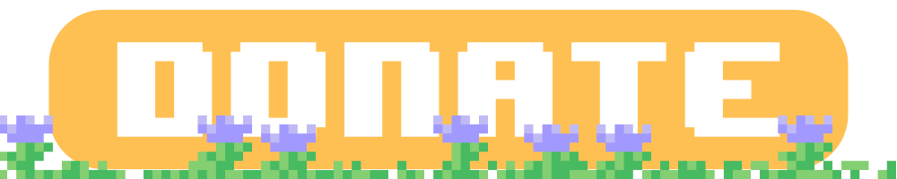

<div align=center>
    <a href="https://github.com/Cozy-Plugins/CozyTreasureHunt/releases">
        </a>
    <a href="">
        </a>
    <a href="https://discord.gg/pax7uFhaaD">
        </a>
</div>

[](https://www.codefactor.io/repository/github/cozy-plugins/cozytreasurehunt)
[](https://github.com/smuddgge/leaf/releases)
[](https://github.com/smuddgge/leaf/issues)
[](https://github.com/smuddgge/leaf/pulls)
[](https://github.com/smuddgge/leaf/releases)
```yaml
#  _____                                    _   _             _
# |_   _| __ ___  __ _ ___ _   _ _ __ ___  | | | |_   _ _ __ | |_
#   | || '__/ _ \/ _` / __| | | | '__/ _ \ | |_| | | | | '_ \| __|
#   | || | |  __/ (_| \__ \ |_| | | |  __/ |  _  | |_| | | | | |_
#   |_||_|  \___|\__,_|___/\__,_|_|  \___| |_| |_|\__,_|_| |_|\__|
#
# Spigot Plugin
# Organisation : Cozy Plugins
# Author : Smudge
```

[](https://bstats.org/plugin/bukkit/CozyTreasureHunt/19286)

- https://www.spigotmc.org/resources/cozytreasurehunt.111614/
- https://modrinth.com/plugin/cozytreasurehunt


\
User-friendly **treasure hunt** creator.

Designed for your **server events**, this plugin will help you **create, log and place** treasure for players to **find, click and gain** a reward!

\


- Create treasure with `/treasure editor`
- Set a treasure location with `/treasure set [name]`
- Spawn the treasure with `/treasure spawn`


# Developers
[](https://github.com/smuddgge/leaf/releases)

**Maven**
```xml
<repository>
    <id>jitpack.io</id>
    <url>https://jitpack.io</url>
</repository>
```
```xml
<dependency>
    <groupId>com.github.Cozy-Plugins</groupId>
    <artifactId>CozyTreasureHunt</artifactId>
    <version>Tag</version>
</dependency>
```

**Gradle**
```gradle
allprojects {
    repositories {
    ...
    maven { url 'https://jitpack.io' }
    }
}
```
```gradle
dependencies {
    implementation 'com.github.Cozy-Plugins:CozyTreasureHunt:Tag'
}
```

## Events
```java
@EventHandler()
public void onTreasurePreClick(TreasurePreClickEvent event) {
    // Called when a treasure is clicked.
}

@EventHandler()
public void onTreasurePreClick(TreasurePostClickEvent event) {
    // Called if the pre click event is not canncelled.
}

@EventHandler()
public void onTreasurePreClick(TreasurePreSpawnEvent event) {
    // Called when a treasure is spawned.
}

@EventHandler()
public void onTreasurePreClick(TreasurePostSpawnEvent event) {
    // Called if the pre spawn event is not canncelled.
}
```

## Data
```java
PlayerData playerData = DataStorage.get(player.getUniqueId());
```

<div align=center>
    <a href="https://www.paypal.com/donate/?hosted_button_id=6UNZH6234RBHW"></a>
</div>